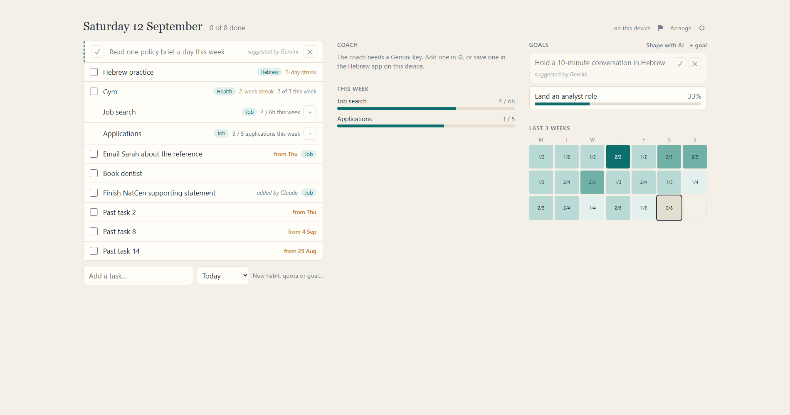
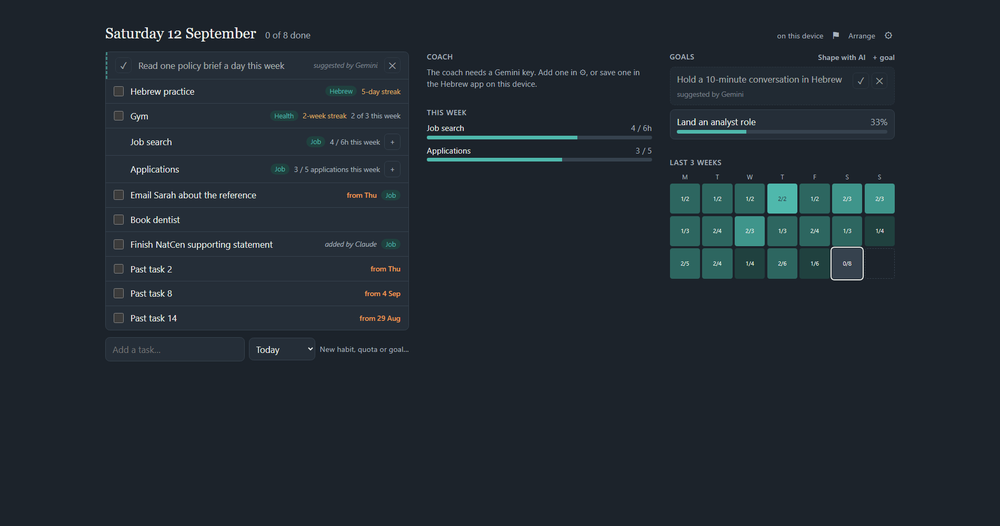

# Report — look, widgets and flags

## Where it stands

All three parts are built, reviewed and checked in a browser. **267 tests pass.** It's on the
branch `look-widgets-flags`, ready to publish (commands at the bottom). Nothing is online until you
push.




## What you'll see

- **Paper by day, Night in the evening.** The Hebrew app's paper-and-ink look until the check-in
  hour (6pm by default), then a dark version of the same palette until the day rolls over at 4am.
  The installed app's title bar changes with it. ⚙ → **Look** lets you pin *Paper* or *Night*
  instead of *Follow the day*. Colours have one job each: teal = you can act on it, gold = you did it
  (streaks, targets met), amber = carried over. The date is in Georgia, and text is a bit bigger on a
  laptop or wider.
- **A layout that uses the window.** The page is up to 1500px wide. On a wide window: today's list
  plus two widget columns. On a laptop: the list plus one. On the phone: everything stacked.
- **Widgets you can arrange.** Coach, This week, Goals and Last 3 weeks are widgets. **Arrange**
  (next to ⚙) lets you drag them between columns (or use ↑ ↓ on a narrow window or the phone), hide
  them, and add hidden ones back; **Done** or Escape locks it. Each device keeps its own arrangement.
  Future integrations will just be more widgets.
- **Flags (⚑).** Click the flag, type what you'd change, press Save (or Ctrl+Enter). It records your
  note plus what the app was doing (look, window size, what's due, coach and sync state — never your
  keys) and syncs to GitHub straight away. The flag goes teal while something hasn't reached GitHub
  yet. **Mark addressed** clears one (it's kept, never deleted, so it can't come back after a sync).
  I'll be able to read them once the Claude integration is built.

## Decisions made without you

- The flag's typed text is scrubbed too: if you paste an error that contains a key, the key is
  replaced before it's stored.
- A half-typed flag is kept if you close the panel, and restored when you reopen it.
- While arranging, the rest of the page is locked to the keyboard as well as the mouse.
- Your GitHub key is no longer written into the settings form's markup (an older issue the final
  review spotted; the Gemini key already worked this way).

## Known small things, left as they are

- If your phone syncs a flag while the laptop is mid-sync, the laptop's ⚑ can stay teal until its
  next sync (a click on the sync status, a focus, or any change clears it).
- The dev-only "fake" label (local testing only) is amber.

## To publish

In the Dashboard folder:

```
git checkout main
git merge look-widgets-flags
git push
```

Then open the dashboard and **reload twice** — the offline copy updates on the first load and shows
the new version on the second.
