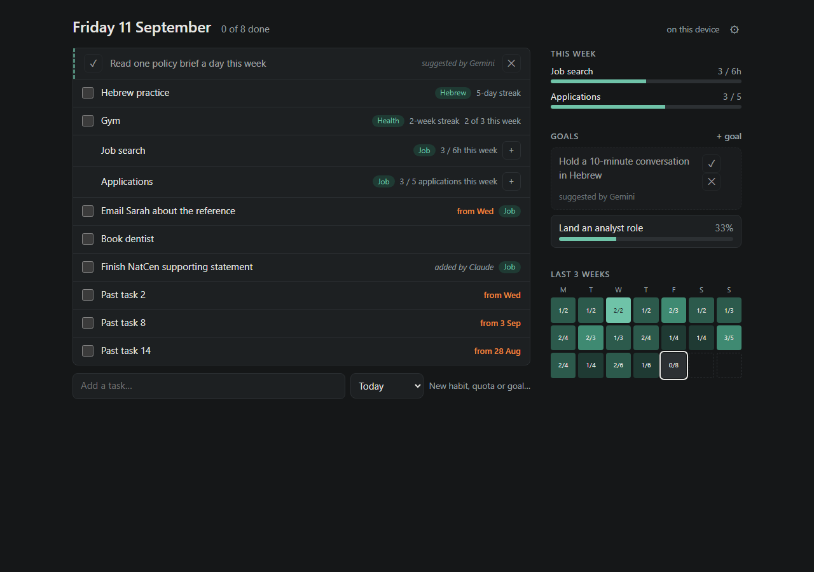
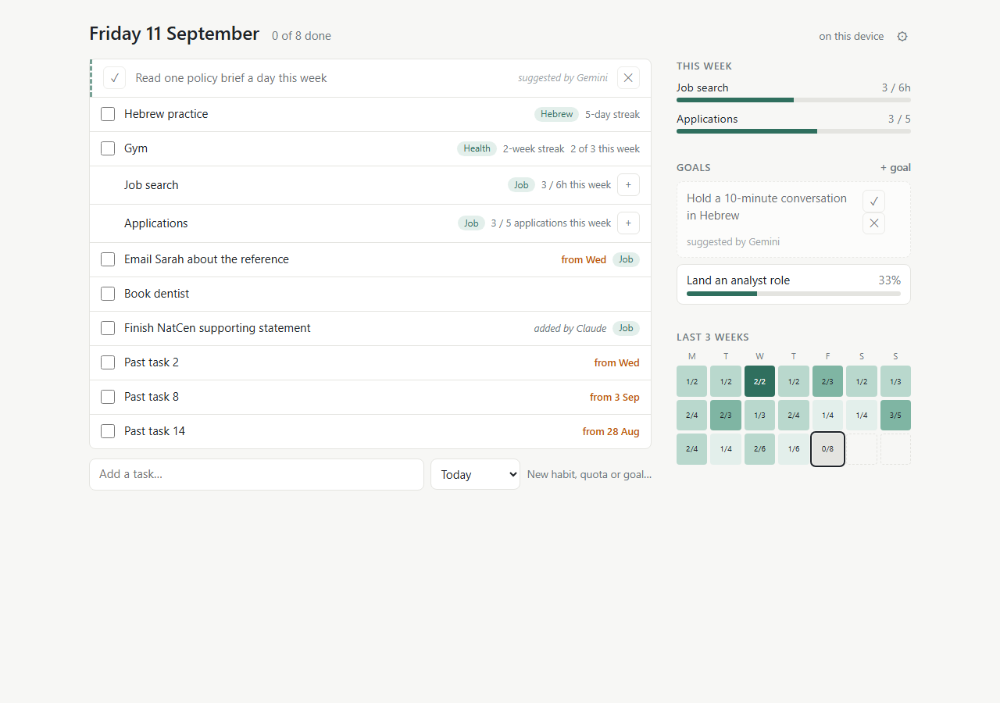
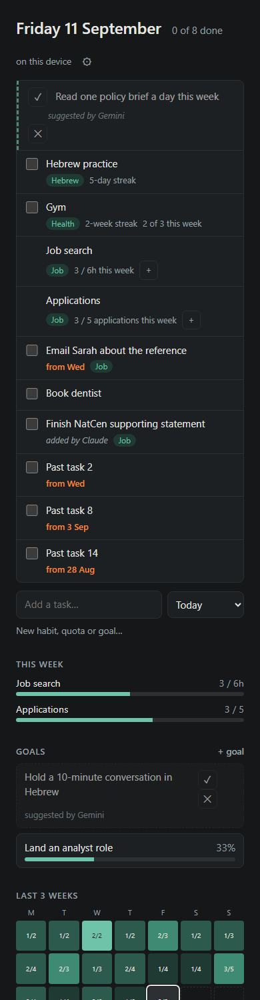

# Morning report — dashboard core hub

## Where it stands

Piece 1 is built, reviewed and working locally. All 106 automated tests pass, and every part of the screen was clicked through in a real browser with no errors. It isn't online yet: publishing it and switching on sync take about 10 minutes of your time (below), because they need your GitHub account and an access key that only you should create.

**The one thing to know first:** the work is on a branch called `core-hub`, not on `main`. The branch question was sent before you went to bed but never got an answer, so I took the safer route. Merging it is the first step below.

## What got built

One screen, as designed:

- **Today's list:**
  - tasks that carry over with an orange *from Tue* marker
  - habits on any repeat rule, with streaks
  - weekly targets with a **+** (counts, or time like `45m` / `1.5h`) and a click-to-see list of this week's entries
  - drag to reorder
  - suggestions from Claude/Gemini with ✓ / ✕
- **Right column:**
  - this week's bars
  - goals with milestones or a number target
  - the last 3 weeks day by day; click a day to see what was done and what was missed
- **Also:**
  - an edit panel (archive, never delete) and settings (sync, the 4am day start, backup export/import)
  - works offline, installs as an app, and syncs through a private GitHub repo

It was built in 14 tasks. Each task had its own review, then the whole thing had three final review rounds. That's 45 commits on `core-hub` (`git log --oneline main..core-hub`).

## Tests

`npm test`: **106 tests, 106 pass, 0 fail**, in about a third of a second. They cover:

- the day logic (4am boundary, repeat rules, carry-over, streaks, history)
- parsing `45m` / `1h30`
- the store
- merging, including properties checked over hundreds of random documents: same result in any order, merging twice changes nothing, three devices converge, nothing is ever dropped
- sync against a fake GitHub, including two simulated devices whose logged amounts add up
- a speed test on a year of fake data

## Screenshots

Desktop (dark, which is your system theme):



Light mode:



Phone width:



## Decisions made without you

**From planning:**
- Tests run under Node (`npm test`) instead of a `tests.html` page, since you installed Node.
- Goal numbers are plain counts. Weekly targets can be time or counts.
- A task ticked before its own date never shows. That can't happen through the screen.

**During the build:**
- **Built on a branch** (`core-hub`); `main` is untouched.
- **Corrupted saved data is set aside, not overwritten.** If this browser's saved data were ever unreadable, the app now keeps the raw copy under `dash_data_corrupt`, starts empty, and shows a warning in the header. Your data then comes back from the sync repo on the next sync. (My plan would have silently overwritten it.)
- **Sync conflicts are recognised precisely.** GitHub uses the same error code for "another device saved first" and for genuine bad requests. Only the first is retried now; anything else is reported straight away with GitHub's own message.
- **Phone layout:** each row's details (tags, streaks, counts) sit on their own line under the title on a phone.
- **One edit panel at a time:** opening another one closes the first (unsaved changes are dropped, as with Cancel).

**From the final reviews** (most of these were flaws in my plan, not in the building):
- **Speed.** The screen would have got slower as your history grew: several seconds per click after a few months, 15 s after a year. It now builds one lookup per screen update; a year of data renders in about 30 ms.
- **Phone ticks get sent before the page sleeps.** When the page is hidden, pending changes sync straight away. Otherwise a quick tick on the phone might not have reached the laptop.
- **Double ticks.** If both devices ticked the same habit before syncing, one untick now clears both.
- **Drag-to-reorder only changes the row you moved.** The old version rewrote every row and could bring back something you'd archived on the other device. It now moves within its own section (unticked or ticked) and handles ties.
- **Data from later pieces survives older copies of the app.** Anything the sync file holds that this version doesn't know about is kept, not dropped. This matters before piece 2 starts writing.
- **Sync only accepts genuine dashboard files.** A mistyped repo name can't overwrite another app's data, such as the Hebrew app's.
- **Large sync files still work.** Past 1 MB (likely within a year), the file is read through GitHub's other API.
- **Malformed records from other tools can't blank the page,** and a failed sync can't get stuck on "syncing…".
- **Two dashboard windows on one computer no longer overwrite each other.** A save from another window is merged in, and is held back (never lost) while you're typing.
- **The 4am boundary follows clock time on the nights the clocks change.**

## Known limitations and loose ends

- **Sync hasn't touched real GitHub yet.** It's tested against a faithful fake, but the first real test is when you connect it this morning. If the header says *sync failing*, hover over it for GitHub's reason and send me that.
- There's no way to **un-archive** something yet (it's kept in the data, just not shown), and no way to **rename a milestone** once added.
- After I push an update, **reload twice** to see it: the offline copy serves the old version once.
- If a second dashboard tab saves while you're mid-way through typing a milestone in this one, switching tabs can clear that half-typed text. It's a narrow case.
- Smaller cosmetic items: the ✓/✕ on a suggested goal stack vertically, a red "bad amount" border stays until you submit, and some drag highlights flicker.
- Some commits credit the model that wrote them (Haiku/Sonnet) rather than the agreed co-author line. Rewriting history for it wasn't worth the risk.
- Your laptop's keep-awake setting in the Claude app was off, so the app couldn't hold the laptop awake itself. It stayed awake anyway.

## What you need to do this morning

The full steps are in the [README](../README.md) under "Morning steps". In short:

1. **Merge and publish.** In the Dashboard folder:
   ```
   git checkout main
   git merge core-hub
   ```
   Then create a **public** GitHub repo named `dashboard`, push to it (`git remote add origin https://github.com/George-Wightman/dashboard.git`, then `git push -u origin main`), and turn on Pages (Settings → Pages → `main` / root). The README assumes your GitHub username is `George-Wightman`, as in the Hebrew app; adjust it if not.
2. **Create the sync store:** a **private** repo named `dashboard-sync`, with a README so it isn't empty.
3. **Create a fine-grained access key** limited to `dashboard-sync` with *Contents: read and write*. Paste it only into the dashboard's ⚙ settings, never into a chat.
4. **Connect the laptop:** ⚙ → repo `George-Wightman/dashboard-sync` + the key → Save. The header should say *synced HH:MM*.
5. **Install it and start it at sign-in** (the Chrome install icon, then a shortcut in `shell:startup`), and add it to your phone's home screen with the same repo and key.

The sample data you might see locally is from `dev/seed.html` and only exists on `localhost`. The published site starts empty.

## Next

Piece 2 on the roadmap is the **Hebrew auto-tick** (reading practice minutes from the Hebrew app's sync file). You moved the **Claude connector** up to piece 3.

Two questions came up for when we plan those:
- Should amounts logged on a weekly target that's linked to a goal also count towards the goal's number? At the moment they don't.
- Do you want an "archived" view for bringing things back?
